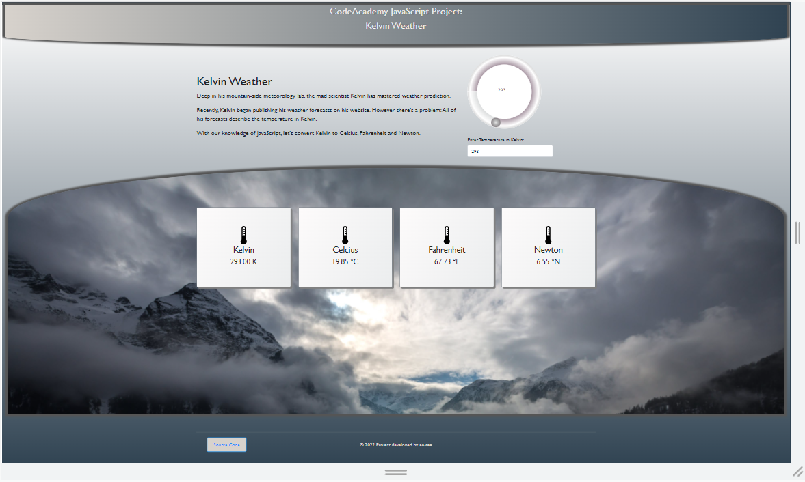

# kelvin-weather-v2.0
<b>CodeAcademy JavaScript Project: Kelvin Weather</b>

(From the course: Learn JavaScript)

Description:  
Deep in his mountain-side meteorology lab, the mad scientist Kelvin has mastered weather prediction. Recently, Kelvin began publishing his weather forecasts on his website. However there's a problem: All of his forecasts describe the temperature in Kelvin. With our knowledge of JavaScript, let's convert Kelvin to Celsius, Fahrenheit and Newton.

 

I was attempting the Kelvin Weather JavaScript project on CodeAcademy and thought, "Mr Kelvin deserves better, let's give him a webpage too while I'm at it!".  
So here it is, a simple front-end edition.

v2.0 Changes: 
• Added a round range slider (number value is linked to input field)  
• Webpage design overhaul

 

Browser Version: <a href="https://ee-tee.github.io/kelvin-weather-v2.0/">https://ee-tee.github.io/kelvin-weather-v2.0/</a>

(kelvinWeatherWeb.js)

 

Normal Version:

(kelvinWeather.js)

